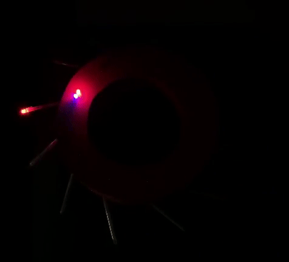
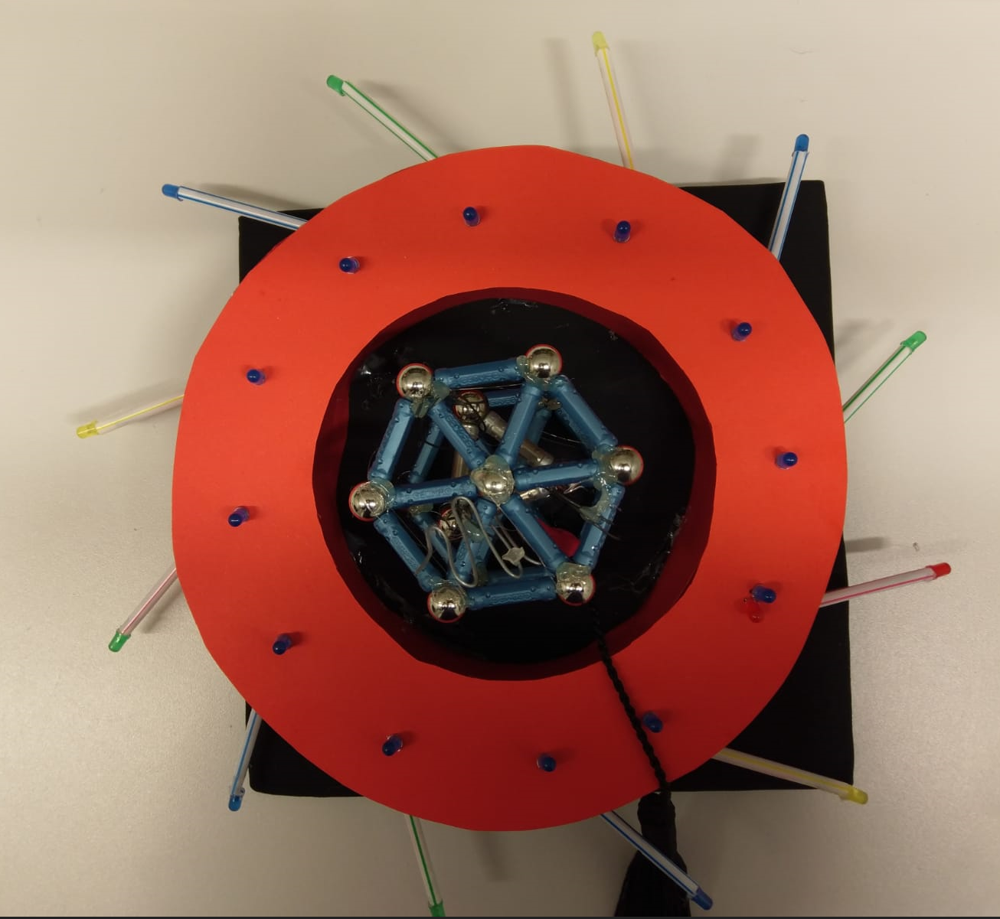

# Arduino Bessy

An Arduino Nano is used to illuminate LEDs along the storage ring and Beamlines of a small model of the synchrotron Bessy. Crafted as a PhD hat. Contributors: Lisa Willig, Jan-Etienne Pudell, Felix Stete, Alexander von Reppert.

   
